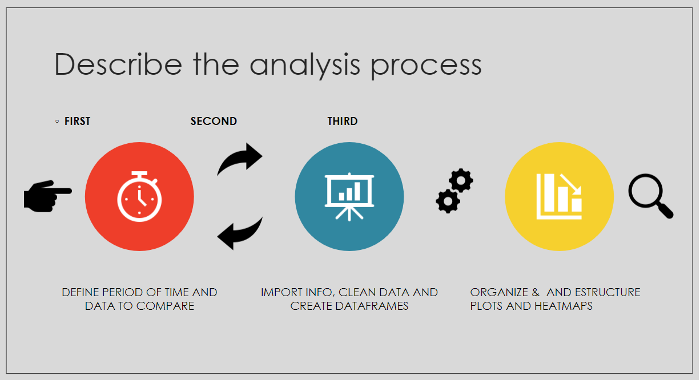
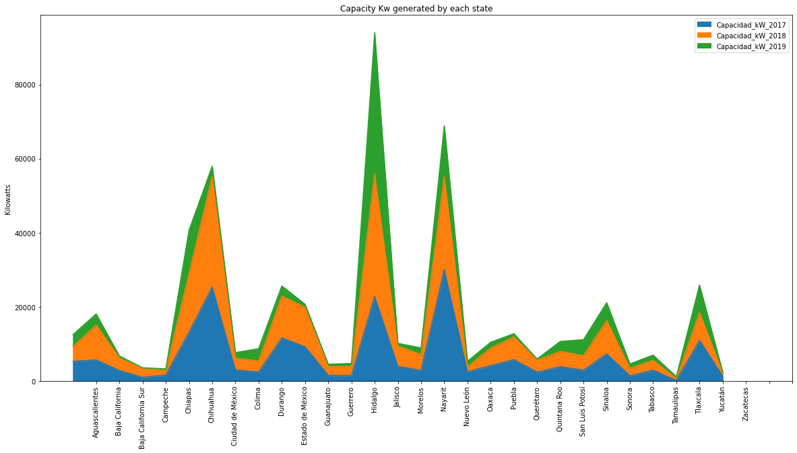
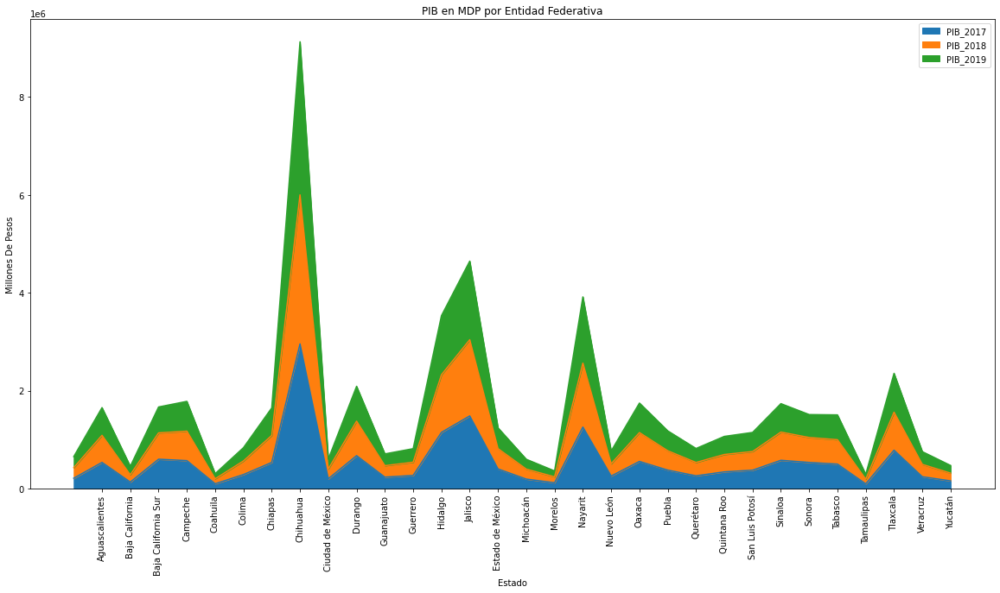
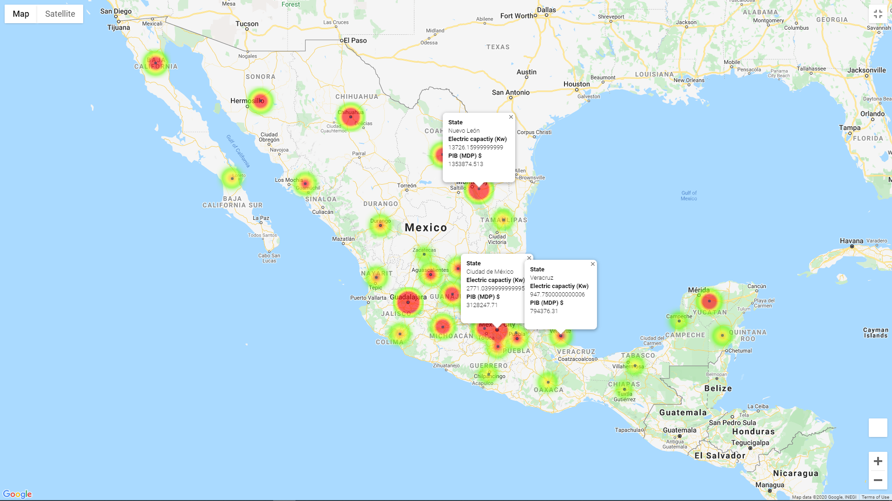
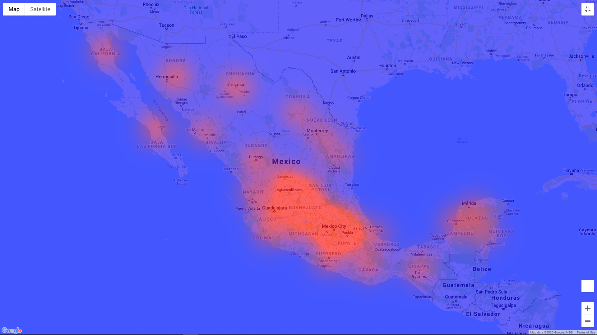

# DOMESTIC SOLAR ENERGY IN MÉXICO

### Project Description/Outline
- [link: ***Power Point Presentation***](<https://docs.google.com/presentation/d/1jTHA0n535YKKVDVY_Yxo4RSxa302Wzga/edit#slide=id.p9>)
- [link: ***Full video of Zoom Presentation***](<https://drive.google.com/drive/u/0/folders/1uHXnIDA2CX2viyn3cr0mOk8Bh01J4g-u>)

The scope of this project is to analyze the domestic solar energy  installation and usage (capacity  kW) in Mexico and compare it with parameters like radiation, growth or/and demand in order to define a correlation.
 Our framework consists in the analysis of the last 3 years (2017, 2018, 2019)  on the Mexican economic growth (ITAEE) or/and PIB VS  solar capacity (Kw).
Hypothesis
 We believe that the greater income each State generates (ITAEE) or/and PIB the  more capacity of solar energy will be installed (kW) . Moreover we will find that “Domestic solar panels are only installed by rich states because solar panels are considered to be expensive“. We are also certain that the market of domestic solar panels is growing in states isolated with more solar radiation.

### FIRST CLEANUP TO ONLY HAVE kW*YEAR :

We drop several columns that we didn´t need.
Moreover we did 2 groupby to sum the total of capacity kW and also ITAEE for 2017 2018 and 2019 .
We had problems  with NaN values we had to convert 0. 
Last we had to redefine  and clean a new df called PIB.
https://github.com/roberto-g-v/team5-solar-energy/blob/

### SECOND CLEANUP TO ORGANIZE AND STRUCURE DATA
After having the correct info we needed to rename and  merge info a new dataframe to  compare it.
We also did  separate df to analyze data independently
At the end when everything was working we did the plots and heatmaps with clean  data.

VS.

### CONCLUSIONS
After mining , cleaning and organizing the data for the “Domestic solar energy  usage in Mexico” and the “PIB by each sate” . We conclude and confirm our hypothesis; 
The richer a state is the more domestic solar panels are installed, active and generating solar energy capacity on (kW) for CFE.
When testing, contrasting and comparing data:  The top 5 state df analysis,  we found out that Nuevo León, Ciudad de Mexico, Jalisco and Estado de México had a correlation (not in the same order) with the top 5 states that generated more PIB in Mexico. Moreover we also observed that Chihuahua that is the 4th in the top 5 state generating solar energy (kW),  is among the last states that generates PIB for Mexico. Vice-versa, Veracruz is the 5th state generating PIB in Mexico but has a really low amount of domestic solar panels working. This indicates that 1 out of 5 states are not governed by thes same rule of ourconfirm hypothesis (richer states have more solar panels).

We dig even deeper and checked why 1 out of 5 states had a disruption with our hypothesis. So we went into the NASA Earths Observatory and looked if solar radiation per each state had something to do with this.  Very compiling  findings and evidence showed us that also the installation and usage of domestic solar panels in Mexico are also governed by the quantity of radiation each state receives through the year. Proof of this is when observing the dataframe and heatmap Chihuahua is the state with more solar radiation in Mexico with a total of 6.33 net rad flux. And Veracruz is the last state with solar radiation with 4.10 net rad flux. Although the findings are mesmerizing more investigation in the solar radiation study is needed . Our recommendations are that solar panels should be cheaper (subsidize)  and more accessible for the people living in marginated zones like Barrancas del Cobre, Chihuahua.  CFE should also continue targeting the states with more solar radiation  = more energy,  to install more  interconnections to the grid for distributed capacity

_______________________________________________
- Email: <roberto.gonzalez.vallejo@gmail.com>
- Author: [Roberto Gonzalez Vallejo](mailto:roberto.gonzalez.vallejo@gmail.com)
- [**Linkedin**](https://www.linkedin.com/in/roberto-gonzalez-vallejo-6ba894144/)
- [**Github**](https://github.com/roberto-g-v)
- © 2020

